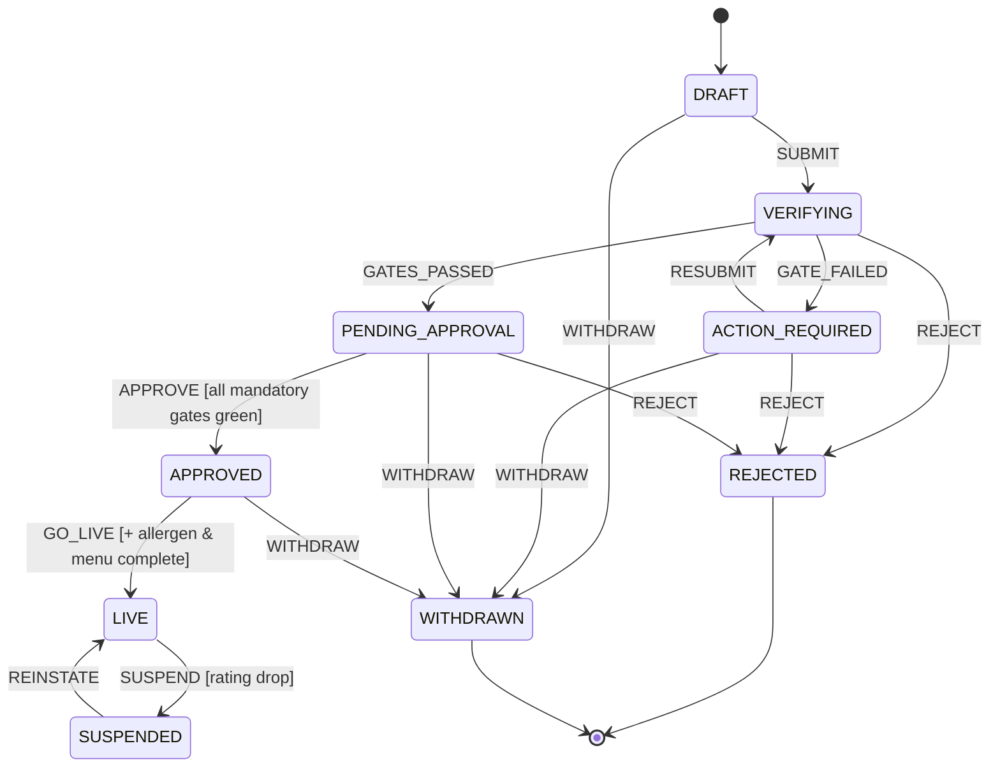
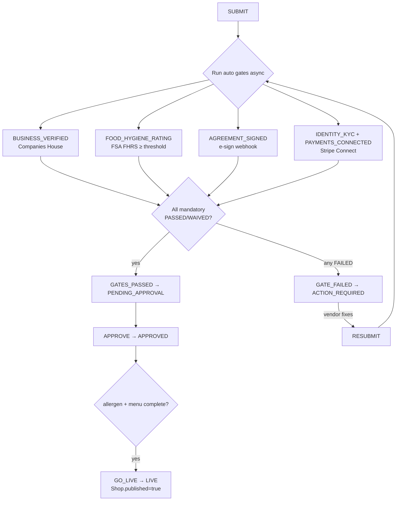

# Vendor Onboarding — State Model & Gate-Chain Schema (Design Draft)

> **Status:** DRAFT design · not yet implemented · **Author aid:** Claude Code · **Date:** 10 July 2026
> **Backs:** [`docs/vendor-onboarding-research.md`](../vendor-onboarding-research.md) (the UK legal/market research this design operationalises)
> **Conforms to:** existing patterns in `uk.jtoye.core` — the Order state machine, Flyway/RLS conventions, and the Stripe integration (all referenced inline).

This document specifies **how a vendor is admitted to J'Toye** as a state machine plus a data-driven **gate chain**. It is deliberately implementation-ready: the DDL targets Flyway **V43**, the entities/state-machine mirror the existing `Order*` classes, and every proposed piece cites the pattern it copies. Nothing here is built yet — it is a plan for a phase.

Legend: **[PROPOSED]** = new code/schema this design introduces · **[EXISTS]** = current codebase, referenced to mirror.

---

## 1. Design goals & decisions

1. **One authoritative lifecycle.** Replace the bare `Shop.published` boolean [EXISTS `shop/Shop.java:73-74`] with an onboarding aggregate whose state machine *owns* the go-live flip. `published` becomes a derived effect of the `GO_LIVE`/`SUSPEND` transitions, not something callers set directly.
2. **Gates are data, not code branches.** Each requirement (hygiene rating, company check, KYC, agreement, allergen completeness…) is a row in `vendor_onboarding_gate` with its own status + evidence. The chain is a registry, so adding/retiring a gate or flipping one mandatory→optional is a config/data change, not a rewrite. (ARCHITECTURE_RULE_8: centralise the policy.)
3. **Hybrid-aware.** The same machine serves both models from the research; which gates are *mandatory* differs by `OnboardingModel` (`MARKETPLACE` vs `WHITE_LABEL`).
4. **Automate the free checks first.** The two zero-cost government APIs (FSA FHRS, Companies House) run automatically and asynchronously; the vendor builds their shop in parallel; go-live is gated on green. (Directly from the research's §5–§6.)
5. **Mirror, don't invent.** State persistence, RLS, audit, Stripe idempotency and config injection all reuse established house patterns so the change is reviewable and low-risk (ARCHITECTURE_RULE_1/2/7).

---

## 2. Domain model

### 2.1 Where onboarding state lives

A new aggregate **`VendorOnboarding`**, one per **tenant** (the legal entity / RLS boundary [EXISTS `tenant/Tenant.java`]), referencing the **shop** being taken live [EXISTS `shop/Shop.java`]. It holds the lifecycle state; a child **`VendorOnboardingGate`** row per requirement holds each gate's result + evidence.

```
Tenant (1) ──< VendorOnboarding (1) ──< VendorOnboardingGate (N)
                     │
                     └── shop_id ──> Shop  (GO_LIVE flips Shop.published)
```

> **Assumption (open decision, §9):** MVP models **one onboarding per tenant** (`UNIQUE(tenant_id)`), gating that tenant's single shop. If a tenant may run multiple shops, business/identity gates become tenant-level and menu/allergen gates become shop-level — noted but out of MVP scope.

### 2.2 States — `OnboardingState` [PROPOSED]

Persisted as `@Enumerated(EnumType.STRING)` → `VARCHAR + CHECK`, exactly like `OrderStatus` [EXISTS `order/OrderStatus.java`, `order/Order.java:45-47`].

| State | Meaning | Terminal? |
|---|---|---|
| `DRAFT` | Tenant/shop created; vendor building catalogue. Initial state. | no |
| `VERIFYING` | Automated gates running (Companies House, FHRS, registration proof). | no |
| `ACTION_REQUIRED` | A gate failed or needs vendor input (no FHRS match, doc rejected, rating too low). Vendor fixes & resubmits. | no |
| `PENDING_APPROVAL` | All *mandatory* gates green; awaiting final approval (auto per policy, or human review). | no |
| `APPROVED` | Eligible to go live; awaiting the vendor's go-live action. | no |
| `LIVE` | `Shop.published = true`; storefront visible. | no |
| `SUSPENDED` | Post-approval compliance breach (e.g. FHRS dropped below threshold) — delisted, `published = false`. Reinstatable. | no |
| `REJECTED` | Cannot onboard. | **yes** |
| `WITHDRAWN` | Vendor abandoned onboarding. | **yes** |

### 2.3 Events — `OnboardingEvent` [PROPOSED]

Mirrors `OrderEvent` [EXISTS `order/OrderEvent.java`].

| Event | Transition | Trigger |
|---|---|---|
| `SUBMIT` | `DRAFT → VERIFYING` | Vendor submits for verification; kicks off the auto gate chain. |
| `GATES_PASSED` | `VERIFYING → PENDING_APPROVAL` | Gate runner: all mandatory gates `PASSED`. |
| `GATE_FAILED` | `VERIFYING → ACTION_REQUIRED` | Gate runner: a mandatory gate `FAILED` / needs input. |
| `RESUBMIT` | `ACTION_REQUIRED → VERIFYING` | Vendor re-triggers after fixing (e.g. new inspection, re-upload). |
| `APPROVE` | `PENDING_APPROVAL → APPROVED` | Auto (policy) or admin action. **Guarded** (§2.4). |
| `REJECT` | `{VERIFYING, ACTION_REQUIRED, PENDING_APPROVAL} → REJECTED` | Admin, or auto on an unrecoverable gate. |
| `GO_LIVE` | `APPROVED → LIVE` | Vendor publishes. **Guarded** (§2.4). Action flips `Shop.published = true`. |
| `SUSPEND` | `LIVE → SUSPENDED` | Compliance monitor (rating drop) or admin. Action flips `published = false`. |
| `REINSTATE` | `SUSPENDED → LIVE` | Rating restored / issue resolved. **Guarded**. Re-flips `published = true`. |
| `WITHDRAW` | `{DRAFT, VERIFYING, ACTION_REQUIRED, PENDING_APPROVAL, APPROVED} → WITHDRAWN` | Vendor abandons. |

### 2.4 Guards

Spring StateMachine transition guards [pattern: `OrderStateMachineConfig` uses `.action(...)`; guards use `.guard(...)`]:

- **`APPROVE`** — every gate where `mandatory = true` has `status IN ('PASSED','WAIVED')`.
- **`GO_LIVE` / `REINSTATE`** — the `APPROVE` guard **plus** `ALLERGEN_DATA_COMPLETE` and `MENU_MINIMUM` gates `PASSED` (these can only be satisfied once the vendor has built the catalogue). This is the hard "before publish" gate from the research (Natasha's Law distance-selling allergen duty).

A rejected transition throws `InvalidStateTransitionException` [EXISTS, thrown by `order/OrderStateMachineService.java:73`].

### 2.5 State diagram



---

## 3. The gate chain

### 3.1 Gate types — `GateType` [PROPOSED]

Each gate declares: whether it runs **automatically**, whether it's **mandatory per model**, and how it's satisfied. The mandatory matrix encodes the research's marketplace-vs-white-label split.

| `GateType` | Auto? | Marketplace | White-label | Satisfied by | Provider (research §6) |
|---|---|---|---|---|---|
| `BUSINESS_VERIFIED` | ✅ | mandatory¹ | mandatory¹ | Company is `active` on Companies House | Companies House API (free) |
| `FOOD_HYGIENE_RATING` | ✅ | **mandatory** | **mandatory** | FHRS rating **≥ 2** (config `min-rating`, default 2) or FHIS `Pass` | FSA FHRS API (free) |
| `FOOD_BUSINESS_REGISTRATION` | ⚠️ attest | **mandatory** | **mandatory** | Vendor attests LA registration + FSA ID; spot-checked | Manual / attestation |
| `IDENTITY_KYC` | ✅ | **mandatory** | optional | Stripe Connect account KYC complete | Stripe Connect (bundles KYC/AML) |
| `PAYMENTS_CONNECTED` | ✅ | **mandatory** | n/a² | Stripe `charges_enabled = true` | Stripe Connect |
| `AGREEMENT_SIGNED` | ✅ webhook | **mandatory** | **mandatory** | e-sign envelope completed | DocuSign / Dropbox Sign |
| `ALLERGEN_DATA_COMPLETE` | ✅ computed | **mandatory** | **mandatory** | Every product has allergen data (V41 fields) | Internal (see §3.3) |
| `MENU_MINIMUM` | ✅ computed | **mandatory** | **mandatory** | ≥ N published-eligible products | Internal |

¹ *Waivable to `WAIVED` for **sole traders**, who have no Companies House record — then `IDENTITY_KYC` becomes mandatory even for white-label (open decision §9).*
² *White-label vendors connect **their own** PSP; J'Toye never touches funds, so there is no platform-side payments gate — see research §3 payments split.*

### 3.2 Gate statuses — `GateStatus` [PROPOSED]

`PENDING` → (`PASSED` | `FAILED` | `MANUAL_REVIEW` | `WAIVED`). `evidence` (JSONB) stores the provider snapshot (e.g. `{"fhrs_rating":4,"establishment_id":123456,"scheme":"FHRS"}`); `external_ref` stores the provider key (FHRS establishment id, CH company number, Stripe account id, e-sign envelope id); `reason` explains a `FAILED`/`WAIVED`.

### 3.3 Gate chain flow



`ALLERGEN_DATA_COMPLETE` is computed from existing V41 columns [EXISTS `product/Product.java`, migration `V41__ppds_label_compliance.sql`]: a product satisfies it when, for its `durability_type`, the required `allergen_spans` are present (the exact predicate mirrors the PPDS rules in [`docs/ppds-label-markup.md`](../ppds-label-markup.md)).

---

## 4. Schema — Flyway `V43__vendor_onboarding.sql` [PROPOSED]

Mirrors the table+RLS+FORCE+policy+`_aud` template of **V36** [EXISTS `db/migration/V36__refunds_and_outbox_exchange.sql`] and the idempotent-DDL house style of V42. GUC is `app.current_tenant_id`; inline predicate style `current_setting('app.current_tenant_id', true)::UUID`.

```sql
-- V43__vendor_onboarding.sql
-- Vendor onboarding aggregate + data-driven gate chain (tenant-scoped, FORCE RLS, Envers-audited).

-- ============ vendor_onboarding (aggregate root) ============
CREATE TABLE IF NOT EXISTS vendor_onboarding (
    id                 UUID PRIMARY KEY,
    tenant_id          UUID         NOT NULL,
    shop_id            UUID         REFERENCES shops(id),
    model              VARCHAR(20)  NOT NULL
                         CHECK (model IN ('MARKETPLACE','WHITE_LABEL')),
    status             VARCHAR(24)  NOT NULL DEFAULT 'DRAFT'
                         CHECK (status IN ('DRAFT','VERIFYING','ACTION_REQUIRED',
                                           'PENDING_APPROVAL','APPROVED','LIVE',
                                           'SUSPENDED','REJECTED','WITHDRAWN')),
    stripe_account_id  VARCHAR(255),                 -- marketplace Connect account (nullable)
    submitted_at       TIMESTAMPTZ,
    approved_at        TIMESTAMPTZ,
    went_live_at       TIMESTAMPTZ,
    suspended_at       TIMESTAMPTZ,
    rejection_reason   TEXT,
    created_at         TIMESTAMPTZ  NOT NULL DEFAULT now(),
    updated_at         TIMESTAMPTZ,
    version            BIGINT       NOT NULL DEFAULT 0,
    CONSTRAINT uq_onboarding_tenant UNIQUE (tenant_id)   -- MVP: one onboarding per tenant
);
CREATE INDEX IF NOT EXISTS idx_onboarding_tenant ON vendor_onboarding (tenant_id);
CREATE INDEX IF NOT EXISTS idx_onboarding_status ON vendor_onboarding (status);  -- compliance monitor scans LIVE

ALTER TABLE vendor_onboarding ENABLE ROW LEVEL SECURITY;
ALTER TABLE vendor_onboarding FORCE  ROW LEVEL SECURITY;
DO $$ BEGIN
  IF NOT EXISTS (SELECT 1 FROM pg_policies WHERE tablename='vendor_onboarding' AND policyname='vendor_onboarding_tenant_policy') THEN
    CREATE POLICY vendor_onboarding_tenant_policy ON vendor_onboarding
        FOR ALL
        USING      (tenant_id = current_setting('app.current_tenant_id', true)::UUID)
        WITH CHECK (tenant_id = current_setting('app.current_tenant_id', true)::UUID);
  END IF;
END $$;

-- ============ vendor_onboarding_gate (one row per requirement) ============
CREATE TABLE IF NOT EXISTS vendor_onboarding_gate (
    id             UUID PRIMARY KEY,
    tenant_id      UUID         NOT NULL,                 -- denormalised for RLS
    onboarding_id  UUID         NOT NULL REFERENCES vendor_onboarding(id),
    gate_type      VARCHAR(32)  NOT NULL
                     CHECK (gate_type IN ('BUSINESS_VERIFIED','FOOD_HYGIENE_RATING',
                                          'FOOD_BUSINESS_REGISTRATION','IDENTITY_KYC',
                                          'PAYMENTS_CONNECTED','AGREEMENT_SIGNED',
                                          'ALLERGEN_DATA_COMPLETE','MENU_MINIMUM')),
    status         VARCHAR(16)  NOT NULL DEFAULT 'PENDING'
                     CHECK (status IN ('PENDING','PASSED','FAILED','MANUAL_REVIEW','WAIVED')),
    mandatory      BOOLEAN      NOT NULL DEFAULT true,
    evidence       JSONB,                                -- provider snapshot
    external_ref   VARCHAR(255),                         -- FHRS id / CH number / Stripe acct / envelope id
    reason         TEXT,
    checked_at     TIMESTAMPTZ,
    created_at     TIMESTAMPTZ  NOT NULL DEFAULT now(),
    updated_at     TIMESTAMPTZ,
    version        BIGINT       NOT NULL DEFAULT 0,
    CONSTRAINT uq_gate_onboarding_type UNIQUE (onboarding_id, gate_type)
);
CREATE INDEX IF NOT EXISTS idx_gate_tenant     ON vendor_onboarding_gate (tenant_id);
CREATE INDEX IF NOT EXISTS idx_gate_onboarding ON vendor_onboarding_gate (onboarding_id);

ALTER TABLE vendor_onboarding_gate ENABLE ROW LEVEL SECURITY;
ALTER TABLE vendor_onboarding_gate FORCE  ROW LEVEL SECURITY;
DO $$ BEGIN
  IF NOT EXISTS (SELECT 1 FROM pg_policies WHERE tablename='vendor_onboarding_gate' AND policyname='vendor_onboarding_gate_tenant_policy') THEN
    CREATE POLICY vendor_onboarding_gate_tenant_policy ON vendor_onboarding_gate
        FOR ALL
        USING      (tenant_id = current_setting('app.current_tenant_id', true)::UUID)
        WITH CHECK (tenant_id = current_setting('app.current_tenant_id', true)::UUID);
  END IF;
END $$;

-- ============ Envers _aud mirrors (all cols nullable; PK (id,rev); FK rev->revinfo) ============
CREATE TABLE IF NOT EXISTS vendor_onboarding_aud (
    id UUID NOT NULL, rev INT NOT NULL REFERENCES revinfo(rev), revtype SMALLINT,
    tenant_id UUID, shop_id UUID, model VARCHAR(20), status VARCHAR(24),
    stripe_account_id VARCHAR(255), submitted_at TIMESTAMPTZ, approved_at TIMESTAMPTZ,
    went_live_at TIMESTAMPTZ, suspended_at TIMESTAMPTZ, rejection_reason TEXT,
    created_at TIMESTAMPTZ, updated_at TIMESTAMPTZ, version BIGINT,
    PRIMARY KEY (id, rev)
);
CREATE TABLE IF NOT EXISTS vendor_onboarding_gate_aud (
    id UUID NOT NULL, rev INT NOT NULL REFERENCES revinfo(rev), revtype SMALLINT,
    tenant_id UUID, onboarding_id UUID, gate_type VARCHAR(32), status VARCHAR(16),
    mandatory BOOLEAN, evidence JSONB, external_ref VARCHAR(255), reason TEXT,
    checked_at TIMESTAMPTZ, created_at TIMESTAMPTZ, updated_at TIMESTAMPTZ, version BIGINT,
    PRIMARY KEY (id, rev)
);

-- _aud RLS: tenant_id IS NULL OR match (Envers may write NULL tenant), FORCE per V35 house rule.
ALTER TABLE vendor_onboarding_aud      ENABLE ROW LEVEL SECURITY;
ALTER TABLE vendor_onboarding_aud      FORCE  ROW LEVEL SECURITY;
ALTER TABLE vendor_onboarding_gate_aud ENABLE ROW LEVEL SECURITY;
ALTER TABLE vendor_onboarding_gate_aud FORCE  ROW LEVEL SECURITY;
DO $$ BEGIN
  IF NOT EXISTS (SELECT 1 FROM pg_policies WHERE tablename='vendor_onboarding_aud' AND policyname='vendor_onboarding_aud_tenant_policy') THEN
    CREATE POLICY vendor_onboarding_aud_tenant_policy ON vendor_onboarding_aud
        FOR ALL
        USING      (tenant_id IS NULL OR tenant_id = current_setting('app.current_tenant_id', true)::UUID)
        WITH CHECK (tenant_id IS NULL OR tenant_id = current_setting('app.current_tenant_id', true)::UUID);
  END IF;
  IF NOT EXISTS (SELECT 1 FROM pg_policies WHERE tablename='vendor_onboarding_gate_aud' AND policyname='vendor_onboarding_gate_aud_tenant_policy') THEN
    CREATE POLICY vendor_onboarding_gate_aud_tenant_policy ON vendor_onboarding_gate_aud
        FOR ALL
        USING      (tenant_id IS NULL OR tenant_id = current_setting('app.current_tenant_id', true)::UUID)
        WITH CHECK (tenant_id IS NULL OR tenant_id = current_setting('app.current_tenant_id', true)::UUID);
  END IF;
END $$;
```

> **Note on `Shop`:** no schema change needed — `published` [EXISTS] stays as the effect column. The state machine becomes the *only* writer of `published`; direct sets in `ShopService` should be removed/guarded during implementation (ARCHITECTURE_RULE_2: avoid breaking — do it behind the new flow).

---

## 5. Java surface [PROPOSED]

All under `uk.jtoye.core.onboarding`. Entities follow the house style [EXISTS `product/Product.java`]: **hand-written getters/setters (no Lombok on entities)**, `@Entity @Table @Audited`, `@GeneratedValue(strategy = GenerationType.UUID)`, `@CreationTimestamp`, `@Enumerated(EnumType.STRING)`, `@Version`, JSONB via `@JdbcTypeCode(SqlTypes.JSON)`.

### 5.1 Entity skeletons (fields only; getters/setters hand-written per house style)

```java
@Entity @Table(name = "vendor_onboarding") @Audited
public class VendorOnboarding {
    @Id @GeneratedValue(strategy = GenerationType.UUID) private UUID id;
    @Column(name = "tenant_id", nullable = false) private UUID tenantId;
    @Column(name = "shop_id") private UUID shopId;
    @Enumerated(EnumType.STRING) @Column(nullable = false, length = 20) private OnboardingModel model;
    @Enumerated(EnumType.STRING) @Column(nullable = false, length = 24) private OnboardingState status = OnboardingState.DRAFT;
    @Column(name = "stripe_account_id") private String stripeAccountId;
    @Column(name = "submitted_at") private OffsetDateTime submittedAt;
    // approved_at, went_live_at, suspended_at, rejection_reason ...
    @CreationTimestamp @Column(name = "created_at", nullable = false, updatable = false) private OffsetDateTime createdAt;
    @Column(name = "updated_at") private OffsetDateTime updatedAt;
    @Version @Column(nullable = false) private long version;
    // + hand-written accessors
}

@Entity @Table(name = "vendor_onboarding_gate") @Audited
public class VendorOnboardingGate {
    @Id @GeneratedValue(strategy = GenerationType.UUID) private UUID id;
    @Column(name = "tenant_id", nullable = false) private UUID tenantId;
    @Column(name = "onboarding_id", nullable = false) private UUID onboardingId;
    @Enumerated(EnumType.STRING) @Column(name = "gate_type", nullable = false, length = 32) private GateType gateType;
    @Enumerated(EnumType.STRING) @Column(nullable = false, length = 16) private GateStatus status = GateStatus.PENDING;
    @Column(nullable = false) private boolean mandatory = true;
    @Column(columnDefinition = "jsonb") @JdbcTypeCode(SqlTypes.JSON) private Map<String,Object> evidence;
    @Column(name = "external_ref") private String externalRef;
    @Column private String reason;
    @Column(name = "checked_at") private OffsetDateTime checkedAt;
    @CreationTimestamp @Column(name = "created_at", nullable = false, updatable = false) private OffsetDateTime createdAt;
    @Version @Column(nullable = false) private long version;
    // + hand-written accessors
}
```

### 5.2 State machine — mirror the `Order*` triad

- **`VendorOnboardingStateMachineConfig`** — `@EnableStateMachineFactory(name = "onboardingStateMachineFactory")`, `StateMachineConfigurerAdapter<OnboardingState, OnboardingEvent>`; states + `.withExternal().source().target().event().guard().action()` transitions. Direct copy of `OrderStateMachineConfig` [EXISTS] structure. Guards per §2.4; the `GO_LIVE` action flips `Shop.published`.
- **`VendorOnboardingStateMachineService`** — `sendEvent(onboardingId, currentState, event)`: build a fresh machine, reset to `currentState` via `DefaultStateMachineContext`, send, throw `InvalidStateTransitionException` on non-`ACCEPTED`. Direct copy of `OrderStateMachineService` [EXISTS `order/OrderStateMachineService.java:45-90`].
- **`VendorOnboardingService.transition(id, event)`** — load, `sendEvent`, `setStatus(newState)`, run side effects (on `GO_LIVE`: `shopService.setPublished(shopId, true)`; on `SUSPEND`: `false`), `save`, then publish a domain/outbox event. Mirrors `OrderService.transitionOrder` [EXISTS `order/OrderService.java:327-367`].

### 5.3 Gate evaluation

```java
public interface OnboardingGate {
    GateType type();
    boolean isAutomatic();
    GateResult evaluate(VendorOnboarding onboarding);   // returns PASSED/FAILED/MANUAL_REVIEW + evidence + externalRef + reason
}
```

Implementations: `CompaniesHouseGate`, `FhrsGate`, `FoodBusinessRegistrationGate` (attestation → `MANUAL_REVIEW`), `StripeConnectKycGate`, `StripePaymentsGate`, `AgreementSignedGate`, `AllergenCompletenessGate`, `MenuMinimumGate`.

**`GateChainRunner`** [PROPOSED] — on `SUBMIT`/`RESUBMIT`, materialises the gate rows for the onboarding's model, runs the automatic ones **asynchronously** (`@Async` — already enabled [EXISTS `CoreApplication`]), records each result, then recomputes: all mandatory `PASSED/WAIVED` → fire `GATES_PASSED`; any mandatory `FAILED` → fire `GATE_FAILED`. Webhook-driven gates (`AGREEMENT_SIGNED`, Stripe `PAYMENTS_CONNECTED`) complete out-of-band and re-trigger the recompute.

### 5.4 External clients (with circuit breakers, mirroring Stripe)

- **`FhrsClient`** → `GET {onboarding.fhrs.base-url}/Establishments?name=&address=` with header **`x-api-version: 2`** (research §6 gotcha: omit it and the API returns no data). Maps rating to `PASSED` if `≥ onboarding.fhrs.min-rating`, or FHIS `Pass`. `@CircuitBreaker(name = "fhrs")` [pattern EXISTS: `payment/PaymentService.java:90` `@CircuitBreaker(name="stripe")`].
- **`CompaniesHouseClient`** → `GET {base-url}/company/{number}` with HTTP Basic (API key as username). `PASSED` iff `company_status = "active"`. `@CircuitBreaker(name = "companies-house")`.
- Both fuzzy-match caveat (research §6): no/ambiguous match → `MANUAL_REVIEW`, never hard-fail.

### 5.5 Stripe Connect — extend the existing integration

Today only PaymentIntents/webhooks/Refunds exist [EXISTS `payment/`]; **no Connect**. Add:
- **`StripeConnectService`** — `createAccount(model, tenantId)` (Express controller-config per research §6), `createAccountLink(...)` (hosted/embedded onboarding). Store `stripe_account_id` on the onboarding.
- **Webhook reuse** — extend the existing dispatcher [EXISTS `payment/PaymentService.handleWebhookEvent:118-172`] with `account.updated`: when `charges_enabled = true`, mark `PAYMENTS_CONNECTED` + `IDENTITY_KYC` `PASSED`. **Reuse the existing idempotency guard** (`processed_stripe_events` + `ON CONFLICT DO NOTHING`) [EXISTS `PaymentService.java:144-150`] and the tenant-from-metadata pattern (put `tenant_id`/`onboarding_id` in the account metadata).

---

## 6. Configuration [PROPOSED]

Grouped config via `@ConfigurationProperties` (preferred house pattern [EXISTS `payment/StripeProperties.java`, `storage/StorageProperties.java`]); no literals (GLOBAL_RULE_6 / ARCHITECTURE_RULE_8).

```java
@Component @ConfigurationProperties(prefix = "onboarding")
public class OnboardingProperties {
    private boolean autoApprove = false;         // PENDING_APPROVAL → APPROVED without human review?
    private int menuMinimum = 1;
    private final Fhrs fhrs = new Fhrs();
    private final CompaniesHouse companiesHouse = new CompaniesHouse();
    public static class Fhrs { private String baseUrl; private int minRating = 2; private String apiVersion = "2"; /*...*/ }
    public static class CompaniesHouse { private String baseUrl; private String apiKey; /*...*/ }
    // accessors
}
```

`application.yml` (every value `${ENV:default}`, secrets default empty — house convention [EXISTS `application.yml:186-188`, `:241`, `:165-167`]):

```yaml
onboarding:
  auto-approve: ${ONBOARDING_AUTO_APPROVE:false}
  menu-minimum: ${ONBOARDING_MENU_MINIMUM:1}
  fhrs:
    base-url: ${FHRS_BASE_URL:https://api.ratings.food.gov.uk}
    min-rating: ${FHRS_MIN_RATING:2}          # DECIDED: 2 (Deliveroo/Uber parity); env-overridable — see §9
    api-version: ${FHRS_API_VERSION:2}
  companies-house:
    base-url: ${COMPANIES_HOUSE_BASE_URL:https://api.company-information.service.gov.uk}
    api-key: ${COMPANIES_HOUSE_API_KEY:}
```

Add matching keys to `.env.example`; Connect/e-sign secrets follow the same `${…:}` empty-default rule.

---

## 7. API surface [PROPOSED]

| Method & path | Actor | Purpose |
|---|---|---|
| `POST /onboarding` | vendor | Create onboarding for the caller's tenant (`DRAFT`), choose `model`. |
| `POST /onboarding/submit` | vendor | Fire `SUBMIT` → starts the auto gate chain. |
| `GET /onboarding/me` | vendor | Current state + per-gate breakdown (the "what's blocking me" view). |
| `POST /onboarding/gates/{type}/resubmit` | vendor | Re-trigger a gate after fixing (e.g. new inspection) → `RESUBMIT`. |
| `POST /onboarding/agreement` | vendor | Create the e-sign envelope; returns signing URL. |
| `POST /onboarding/payments/connect` | vendor | Create the Stripe Connect account link (marketplace). |
| `POST /onboarding/go-live` | vendor | Fire `GO_LIVE` (guard-checked) → publishes the shop. |
| `GET /admin/onboarding?status=PENDING_APPROVAL` | admin | Review queue. `@PreAuthorize("hasRole('admin')")` [pattern EXISTS `DevTenantController`]. |
| `POST /admin/onboarding/{id}/approve` \| `/reject` | admin | `APPROVE` / `REJECT`. |
| `POST /public/payments/webhook` | Stripe | **Existing** endpoint [EXISTS `PaymentController:30`] — extend to handle `account.updated`. |

Controllers stay thin (5–15 lines, delegate to service) per project convention. Standard RFC-7807 errors via the existing `GlobalExceptionHandler` [EXISTS].

---

## 8. Compliance monitoring [PROPOSED]

The research shows platforms **re-check FHRS and delist** on a drop. A `@Scheduled` job (pattern EXISTS: `cleanup.stale-draft-hours` [`application.yml:241`]) periodically re-evaluates `FOOD_HYGIENE_RATING` for all `LIVE` onboardings — ideally against the **FSA bulk XML** (research §6: cheaper than per-vendor API calls at scale) — and fires `SUSPEND` when a rating falls below `onboarding.fhrs.min-rating`, flipping `published = false` and notifying the vendor. Interval is config: `onboarding.monitor.cron: ${ONBOARDING_MONITOR_CRON:0 0 3 * * *}`.

---

## 9. Open decisions (carry from research → confirm before build)

1. **Auto-approve vs human gate — DECIDED (2026-07-11): hybrid by model** (see [ADR-0001](decisions/ADR-0001-onboarding-approval-and-stripe-money-flow.md), #178 item 1). `PENDING_APPROVAL → APPROVED` fires automatically for **WHITE_LABEL** once all mandatory gates are green; **MARKETPLACE** always requires human approval. Config: `onboarding.auto-approve-models` (default `[WHITE_LABEL]`) is the per-model policy; `onboarding.auto-approve` remains a **global force-on override** (when `true`, every model auto-approves; when `false`, per-model policy applies). The APPROVE and GO_LIVE guards still enforce every mandatory gate, so auto-approve skips only the human review step, never a compliance check. The admin approve/reject queue that lets MARKETPLACE leave `PENDING_APPROVAL` is tracked as **#178 slice 2**.
2. **FHRS threshold — DECIDED: `min-rating = 2`** (Deliveroo/Uber parity — the permissive end, so smaller/newer vendors aren't shut out; override per environment via `FHRS_MIN_RATING`). *Still open:* how to treat **"awaiting inspection"** (admit provisionally?) and how to map **Scotland FHIS `Pass`** onto this threshold.
3. **Onboarding granularity.** One-per-tenant (MVP `UNIQUE(tenant_id)`) vs one-per-shop for multi-shop tenants (business/KYC gates would hoist to tenant level).
4. **Sole traders.** No Companies House record → `BUSINESS_VERIFIED = WAIVED` and require stronger `IDENTITY_KYC`? Confirm the substitution rule.
5. **Nations.** England-only first, or branch Wales/NI/Scotland rules (hygiene-display, Natasha's Law SIs, alcohol licensing) at onboarding? (Research §2 nation table.)
6. **White-label verification depth.** How much identity proofing when J'Toye never touches their money? (`IDENTITY_KYC` optional vs mandatory.)
7. **Delivery model.** If couriers are ever run in-house, an extra gate set (right-to-work, worker-status structuring) attaches — see research §4. Out of this MVP.

---

## 10. Test plan (required to keep the `docs-freshness` gate green)

Implementation **must** add tests and bump `docs/metrics.json` (project standard is currently 775 logical invocations, enforced by the `docs-freshness` CI gate — see root `CLAUDE.md`). Minimum set:

- **State machine** (`@Test` unit): every legal transition accepted; illegal transitions throw `InvalidStateTransitionException`; `GO_LIVE`/`APPROVE` guards reject when gates incomplete. *(mirror the existing order state-machine tests)*
- **RLS** (Testcontainers, real Postgres): a tenant cannot read/write another tenant's `vendor_onboarding` / `vendor_onboarding_gate`; `_aud` rows respect the `tenant_id IS NULL OR …` predicate. *(mirror existing RLS contract tests)*
- **Gate evaluators** (unit): FHRS ≥ threshold → `PASSED`; below → `FAILED`; no match → `MANUAL_REVIEW`; CH `active` → `PASSED`; allergen-completeness predicate over V41 fields.
- **External clients** (WireMock): `FhrsClient` sends `x-api-version: 2`; `CompaniesHouseClient` Basic auth; circuit-breaker fallback on 5xx.
- **Stripe `account.updated` webhook** (integration): idempotent via existing `processed_stripe_events` guard; `charges_enabled` flips `PAYMENTS_CONNECTED` + `IDENTITY_KYC`.
- **E2E happy path** (Playwright, optional for MVP): submit → gates green → approve → go-live → storefront visible.

---

## 11. Suggested first slice (thinnest vertical MVP)

Ship the smallest compliant increment (research §7): **`VendorOnboarding` aggregate + the two free-API gates (`BUSINESS_VERIFIED`, `FOOD_HYGIENE_RATING`) + `ALLERGEN_DATA_COMPLETE` + the state machine driving `Shop.published`.** Defer Stripe Connect, e-sign and monitoring to slice 2. This delivers the industry's hard vetting rule (hygiene gate) and the key legal gate (allergen completeness) at **zero third-party cost**, and is identical for both models.

---

*Design draft — pairs with `docs/vendor-onboarding-research.md`. Not yet implemented; intended as the input to a `/gsd-plan-phase` (or equivalent) for the vendor-onboarding phase.*
